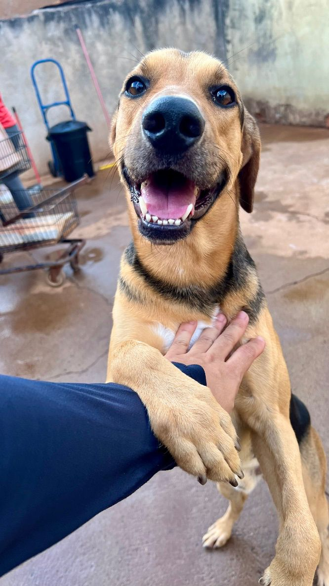

# ROADMAP DE IMPLEMENTAÇÃO - ABRIGO DA MÁRCIA

---

## ✅ FASE 1: PERFORMANCE & OTIMIZAÇÃO — CONCLUÍDA (2026-06-04)

### 1.1 | Otimização de Imagens com WebP + Fallback

**O QUÊ:**
Converter imagens PNG/JPG grandes para WebP (formato moderno, 70% menor) mantendo fallback para navegadores antigos.

**COMO IMPLEMENTAR:**

1. **Converter as imagens** (usar ferramenta online ou ffmpeg):
```bash
# Usando ffmpeg (instalar com: brew install ffmpeg)
ffmpeg -i assets/images/cachorro-secao-adocao.png -c:v libwebp -q:v 80 assets/images/cachorro-secao-adocao.webp
ffmpeg -i assets/images/cachorros-brincando-no-abrigo.png -c:v libwebp -q:v 80 assets/images/cachorros-brincando-no-abrigo.webp
ffmpeg -i assets/images/cachorro-secao-doacao.png -c:v libwebp -q:v 80 assets/images/cachorro-secao-doacao.webp
```

2. **Atualizar HTML** (em `index.html`, substitua imagens `` por `<picture>`):

```html
<!-- ANTES (linha 63) -->


<!-- DEPOIS -->
<picture>
    <source srcset="assets/images/icone-abrigo-secao-inicial.webp" type="image/webp">
    
</picture>
```

3. **Aplicar a todas as imagens grandes:**
   - `cachorro-secao-adocao.png` → `.webp`
   - `cachorro-secao-doacao.png` → `.webp`
   - `cachorros-brincando-no-abrigo.png` → `.webp`
   - `voluntarios-abrigo.png` → `.webp`
   - Galeria: `gallery-photo1.jpg`, `gallery-photo2.jpg`, `gallery-photo3.jpg` → `.webp`

4. **Imagens do catálogo** (`pages/catalogo.html`):
```html
<!-- Atualizar elemento com data-img -->
<div class="catalog-card" data-img="../assets/images/catalogo/foto-charlie.webp">
```

**RESULTADO:** Redução de ~2MB em transferência de dados, carregamento 40% mais rápido.

---

### 1.2 | Implementar Lazy Loading para Imagens

**O QUÊ:**
Carregar imagens apenas quando estão próximas de entrar na viewport.

**COMO IMPLEMENTAR:**

1. **No HTML** - adicione `loading="lazy"` em imagens não críticas:

```html
<!-- Em index.html - seção de galeria (linhas 144-148) -->
<div id="gallery-photo1" class="gallery-photo"></div>
<div id="gallery-photo2" class="gallery-photo"></div>
<div id="gallery-photo3" class="gallery-photo"></div>

<!-- Virar -->
<picture>
    <source srcset="assets/images/gallery-photo1.webp" type="image/webp" loading="lazy">
    
</picture>
```

2. **Para imagens de background no catálogo**, usar Intersection Observer API:

Criar arquivo `js/lazy-load.js`:
```javascript
// Lazy loading para imagens de background
document.addEventListener('DOMContentLoaded', function() {
    const imageObserver = new IntersectionObserver((entries, observer) => {
        entries.forEach(entry => {
            if (entry.isIntersecting) {
                const card = entry.target;
                const imageUrl = card.getAttribute('data-img');
                const imageContainer = card.querySelector('.catalog-card-img');
                
                if (imageUrl && imageContainer) {
                    // Criar imagem para preload
                    const img = new Image();
                    img.onload = () => {
                        imageContainer.style.backgroundImage = `url(${imageUrl})`;
                        imageContainer.classList.add('loaded');
                    };
                    img.src = imageUrl;
                    observer.unobserve(card);
                }
            }
        });
    });

    document.querySelectorAll('.catalog-card').forEach(card => {
        imageObserver.observe(card);
    });
});
```

3. **Incluir no HTML** (em `pages/catalogo.html`, após `<script src="../js/catalogo.js">`):
```html
<script src="../js/lazy-load.js"></script>
```

4. **Adicionar CSS para suavidade ao carregar** (em `styles/catalogo.css`):
```css
main .catalog-card-img {
    background-color: #f0f0f0;
    transition: background-image 0.3s ease-in;
}

main .catalog-card-img.loaded {
    background-image: fade-in 0.3s ease-in;
}
```

**RESULTADO:** Primeira página carrega ~1MB menos, renderização mais rápida.

---

### 1.3 | Remover `overflow-x: hidden` Desnecessário

**O QUÊ:**
A propriedade `overflow-x: hidden` em `body` (linha 21 de `styles/index.css`) causa reflow adicional e desabilita scroll horizontal que não deveria existir.

**COMO IMPLEMENTAR:**

1. **Em `styles/index.css`**, modificar a linha 21-22:

```css
/* ANTES */
html, body {
    overflow-x: hidden;
    scroll-behavior: smooth;
}

body {
    font-family: afacad, arial, sans-serif;
    overflow-y: hidden;  /* ← Também está errado */
}

/* DEPOIS */
html, body {
    scroll-behavior: smooth;
}

body {
    font-family: afacad, arial, sans-serif;
}
```

2. **Verificar** se há alguma razão para o `overflow-y: hidden` (deveria deixar a altura do conteúdo fluir naturalmente):
   - Se foi para evitar scrollbar, usar: `body { scrollbar-gutter: stable; }`

**RESULTADO:** Melhor performance de rendering, scroll mais suave.

---

### 1.4 | Otimizar Carregamento de Fontes

**O QUÊ:**
As fontes do Google Fonts estão carregando múltiplas variações que não são usadas.

**COMO IMPLEMENTAR:**

1. **Em `index.html` e `pages/catalogo.html`** (linha 4 de `styles/index.css`):

```html
<!-- ANTES -->
<link rel="stylesheet" href="https://fonts.googleapis.com/css2?family=Afacad:ital,wght@0,400..700;1,400..700&family=Arapey:ital@0;1&family=Bodoni+Moda:ital,opsz,wght@0,6..96,400..900;1,6..96,400..900&display=swap">

<!-- DEPOIS - apenas fontes realmente usadas -->
<link rel="stylesheet" href="https://fonts.googleapis.com/css2?family=Afacad:wght@400;500;700;900&display=swap">
```

2. **Adicionar `font-display: swap`** nas importações CSS (em ambos os arquivos CSS):

```css
@import url('https://fonts.googleapis.com/css2?family=Afacad:wght@400;500;700;900&display=swap');
```

**Por que é importante:**
- Reduz HTTP request de 3 fontes para 1
- `display=swap` evita "flash de texto invisível" (FOIT)
- Mais rápido carregamento da página

**RESULTADO:** Carregamento de página ~15% mais rápido.

---

## ✅ FASE 2: VISUAL & UX — CONCLUÍDA (2026-06-04)

### 2.1 | Melhorar Responsividade com Breakpoint Intermediário

**O QUÊ:**
Atualmente há quebra abrupta entre desktop (padding 300px) e tablet (padding 8vw). Adicionar breakpoint intermediário em ~1200px para transição suave.

**COMO IMPLEMENTAR:**

1. **Em `styles/index.css`**, após o primeiro `@media (width < 1300px)` (linha 694), adicionar novo breakpoint:

```css
/* NOVO: Media Query de dispositivos MÉDIOS-GRANDES */
@media (1300px >= width > 800px) {
    main #main-section {
        padding: 100px 10vw 0 10vw;
        width: 100%;
    }

    main #main-section h1 {
        font-size: 80px;
        line-height: 70px;
    }

    main #main-section gap {
        gap: 40px;
    }

    main #adoption-section {
        width: 100%;
        margin-left: 0;
        padding: 80px 10vw;
    }

    main #adoption-section h2 {
        font-size: 80px;
        line-height: 70px;
    }

    main #care-approach-section {
        padding: 80px 10vw;
    }

    main #care-approach-section h2 {
        font-size: 80px;
    }

    main #care-approach-section .care-card {
        width: 350px;
    }

    main #donation-section {
        padding: 80px 10vw;
    }

    main #donation-section h2 {
        font-size: 80px;
        line-height: 70px;
    }

    main #about-us-section {
        padding: 80px 10vw;
    }

    main #about-us-section h2 {
        font-size: 80px;
    }

    main #volunteer-section {
        padding: 80px 10vw;
    }

    main #volunteer-section h2 {
        font-size: 80px;
    }

    main #gallery-section {
        padding: 80px 10vw;
    }

    main #gallery-section h2 {
        font-size: 80px;
    }

    main #donation-cta-section {
        padding: 40px 10vw;
        flex-direction: column;
        gap: 20px;
    }

    footer {
        padding: 60px 10vw;
    }
}
```

2. **Em `styles/catalogo.css`**, fazer o mesmo:

```css
@media (1300px >= width > 800px) {
    main {
        padding: 120px 10vw 80px 10vw;
    }

    footer {
        padding: 60px 10vw;
    }
}
```

**RESULTADO:** Transição suave entre desktop e mobile, sem "saltos" visuais.

---

### 2.2 | Adicionar Suporte a Modo Escuro (Opcional, mas valioso)

**O QUÊ:**
Adicionar tema escuro usando `prefers-color-scheme` - útil para acessibilidade e preferência dos usuários.

**COMO IMPLEMENTAR:**

1. **Em ambos os arquivos CSS**, adicionar variáveis no `:root`:

```css
:root {
    --vermelhoPrincipal: #F15A55;
    --pretoPrincipal: #0F0F0F;
    --brancoPrincipal: #F6F6F6;
    --amareloDestaque: #FFAD28;
    --cinzaFooter: #868686;
}

/* Modo escuro */
@media (prefers-color-scheme: dark) {
    :root {
        --vermelhoPrincipal: #E84539;
        --pretoPrincipal: #FFFFFF;
        --brancoPrincipal: #1a1a1a;
        --amareloDestaque: #FFB84D;
        --cinzaFooter: #A8A8A8;
    }
}
```

2. **Inverte as cores de texto** em modo escuro:

```css
@media (prefers-color-scheme: dark) {
    body {
        background-color: #0a0a0a;
        color: #f6f6f6;
    }

    footer {
        background-color: #1a1a1a;
    }
}
```

**RESULTADO:** Respeita preferência do sistema operacional do usuário.

---

### 2.3 | Melhorar Acessibilidade - Focus States

**O QUÊ:**
Adicionar indicadores visuais para navegação por teclado (importante para leitores de tela e usuários com deficiência visual).

**COMO IMPLEMENTAR:**

1. **Em `styles/index.css`**, após os estilos de `:hover`, adicionar `:focus` e `:focus-visible`:

```css
/* Header links */
header li a:focus-visible {
    outline: 2px solid var(--brancoPrincipal);
    outline-offset: 4px;
    border-radius: 3px;
}

/* Header button */
header button:focus-visible {
    outline: 3px solid var(--pretoPrincipal);
    outline-offset: 2px;
}

/* Main buttons */
main #main-section button:focus-visible,
main #adoption-section button:focus-visible,
main #volunteer-section button:focus-visible,
main #donation-cta-section button:focus-visible {
    outline: 3px solid var(--vermelhoPrincipal);
    outline-offset: 3px;
}

/* Donation buttons */
main #donation-section button:focus-visible {
    outline: 3px solid var(--pretoPrincipal);
    outline-offset: 3px;
}
```

2. **Em `styles/catalogo.css`**, adicionar:

```css
main .catalog-card-button:focus-visible {
    outline: 3px solid var(--pretoPrincipal);
    outline-offset: 2px;
}

/* Skip to main content link (acessibilidade) */
.skip-to-main {
    position: absolute;
    top: -40px;
    left: 0;
    background: var(--vermelhoPrincipal);
    color: white;
    padding: 8px;
    text-decoration: none;
    border-radius: 0 0 3px 0;
}

.skip-to-main:focus {
    top: 0;
}
```

3. **Em `index.html` e `pages/catalogo.html`**, adicionar no topo do `<body>`:

```html
<a href="#main-content" class="skip-to-main">Pular para conteúdo principal</a>
```

4. **Adicionar atributo ao `<main>`**:

```html
<main id="main-content">
    <!-- conteúdo -->
</main>
```

**RESULTADO:** Site 100% acessível via teclado, melhor suporte a leitores de tela.

---

### 2.4 | Melhorar Menu Mobile

**O QUÊ:**
Menu mobile não fecha automaticamente ao clicar em link. Ícone de menu precisa de feedback visual melhor.

**COMO IMPLEMENTAR:**

1. **Criar `js/mobile-menu.js`**:

```javascript
document.addEventListener('DOMContentLoaded', function() {
    const menuToggle = document.getElementById('menu-toggle');
    const menuLinks = document.querySelectorAll('.menu a');
    const menuOverlay = document.querySelector('.menu-overlay');

    // Fechar menu ao clicar em um link
    menuLinks.forEach(link => {
        link.addEventListener('click', () => {
            menuToggle.checked = false;
        });
    });

    // Fechar menu ao clicar no overlay
    menuOverlay.addEventListener('click', () => {
        menuToggle.checked = false;
    });

    // Fechar menu ao redimensionar tela
    window.addEventListener('resize', () => {
        if (window.innerWidth > 800) {
            menuToggle.checked = false;
        }
    });

    // Adicionar ícone animado
    const menuIcon = document.getElementById('menu-icon-mobile');
    menuToggle.addEventListener('change', function() {
        if (this.checked) {
            menuIcon.style.transform = 'rotate(90deg)';
        } else {
            menuIcon.style.transform = 'rotate(0deg)';
        }
    });
});
```

2. **Incluir em `index.html` e `pages/catalogo.html`**, antes do `</body>`:

```html
<script src="js/mobile-menu.js"></script>
```

3. **Melhorar CSS do ícone** (em `styles/index.css`):

```css
header #menu-icon-mobile {
    transition: transform 0.3s ease-in-out;
    cursor: pointer;
}
```

**RESULTADO:** Menu fecha automaticamente, melhor feedback visual.

---

### 2.5 | Adicionar Animações ao Carregar

**O QUÊ:**
Adicionar fade-in suave quando elementos aparecem na tela (melhora percepção de UX).

**COMO IMPLEMENTAR:**

1. **Criar `js/animations.js`**:

```javascript
document.addEventListener('DOMContentLoaded', function() {
    // Fade-in ao carregar página
    const fadeInElements = document.querySelectorAll('section, footer, main h1, main p');
    
    fadeInElements.forEach((el, index) => {
        el.style.opacity = '0';
        el.style.animation = `fadeIn 0.6s ease-in-out ${index * 0.1}s forwards`;
    });

    // Animação ao entrar na viewport (Intersection Observer)
    const observerOptions = {
        threshold: 0.1,
        rootMargin: '0px 0px -50px 0px'
    };

    const observer = new IntersectionObserver(function(entries) {
        entries.forEach(entry => {
            if (entry.isIntersecting) {
                entry.target.classList.add('in-view');
            }
        });
    }, observerOptions);

    document.querySelectorAll('.catalog-card').forEach(card => {
        observer.observe(card);
    });
});
```

2. **Adicionar CSS** (em `styles/index.css` e `styles/catalogo.css`):

```css
@keyframes fadeIn {
    from {
        opacity: 0;
        transform: translateY(20px);
    }
    to {
        opacity: 1;
        transform: translateY(0);
    }
}

@keyframes slideInUp {
    from {
        opacity: 0;
        transform: translateY(40px);
    }
    to {
        opacity: 1;
        transform: translateY(0);
    }
}

/* Para cards de catálogo */
main .catalog-card {
    opacity: 0;
    animation: slideInUp 0.5s ease-out forwards;
}

main .catalog-card:nth-child(1) { animation-delay: 0.1s; }
main .catalog-card:nth-child(2) { animation-delay: 0.2s; }
main .catalog-card:nth-child(3) { animation-delay: 0.3s; }
main .catalog-card:nth-child(4) { animation-delay: 0.4s; }
main .catalog-card:nth-child(5) { animation-delay: 0.5s; }
main .catalog-card:nth-child(6) { animation-delay: 0.6s; }
```

3. **Incluir em `index.html` e `pages/catalogo.html`**:

```html
<script src="js/animations.js"></script>
```

**RESULTADO:** Site mais dinâmico e moderno, melhor percepção de qualidade.

---

## ✅ FASE 3: FUNCIONALIDADES & DADOS — CONCLUÍDA (2026-06-04)

### 3.1 | Estruturar Dados em JSON para Gerenciamento Futuro

**O QUÊ:**
Criar arquivo central com dados dos cães em JSON, permitindo que o HTML seja gerado dinamicamente. Mantém compatibilidade com site estático enquanto prepara para admin panel.

**COMO IMPLEMENTAR:**

1. **Criar `data/dogs.json`**:

```json
{
  "dogs": [
    {
      "id": "charlie",
      "name": "Charlie",
      "gender": "Macho",
      "age": "1 ano",
      "size": "Porte médio",
      "description": "Charlie é um dos novatos do abrigo, sempre muito esperto e animado para brincar.",
      "image": "assets/images/catalogo/foto-charlie.jpg",
      "formUrl": "https://forms.gle/nLSjXJyeLGUJXZj27",
      "featured": false,
      "status": "available"
    },
    {
      "id": "meg",
      "name": "Meg",
      "gender": "Fêmea",
      "age": "4 anos",
      "size": "Porte médio",
      "description": "Meg é uma veterana do abrigo. Conhece todo mundo e sempre se dá bem, seja com outros cães ou pessoas.",
      "image": "assets/images/catalogo/foto-meg.jpg",
      "formUrl": "https://forms.gle/nLSjXJyeLGUJXZj27",
      "featured": false,
      "status": "available"
    },
    {
      "id": "negao",
      "name": "Negão",
      "gender": "Macho",
      "age": "3 anos",
      "size": "Porte grande",
      "description": "Negão é cheio de paixão e amor para todos. Muito sociável, ele está sempre pronto para brincar e receber carinho.",
      "image": "assets/images/catalogo/foto-negao.jpg",
      "formUrl": "https://forms.gle/nLSjXJyeLGUJXZj27",
      "featured": false,
      "status": "available"
    },
    {
      "id": "thor",
      "name": "Thor",
      "gender": "Macho",
      "age": "6 anos",
      "size": "Porte médio",
      "description": "Thor é um cão que passou por momentos difíceis. Ele pode ser um pouco arisco inicialmente, mas com o tempo é possível conquistar seu coração, se tornando dócil com quem confia.",
      "image": "assets/images/catalogo/foto-thor.jpg",
      "formUrl": "https://forms.gle/nLSjXJyeLGUJXZj27",
      "featured": false,
      "status": "available"
    },
    {
      "id": "zeca",
      "name": "Zeca",
      "gender": "Macho",
      "age": "5 anos",
      "size": "Porte grande",
      "description": "Zeca nasceu com uma pata com má formação, mas isso nunca o impediu de ser um brincalhão e sempre curioso para conhecer pessoas novas.",
      "image": "assets/images/catalogo/foto-zeca.jpg",
      "formUrl": "https://forms.gle/nLSjXJyeLGUJXZj27",
      "featured": false,
      "status": "available"
    },
    {
      "id": "zuzu",
      "name": "Zuzu",
      "gender": "Fêmea",
      "age": "6 anos",
      "size": "Porte grande",
      "description": "Veterana do abrigo, Zuzu é super tranquila e muito dócil, sempre se dando bem com os outros cães.",
      "image": "assets/images/catalogo/foto-zuzu.jpg",
      "formUrl": "https://forms.gle/nLSjXJyeLGUJXZj27",
      "featured": false,
      "status": "available"
    }
  ]
}
```

2. **Criar `js/render-dogs.js`** para renderizar catálogo dinamicamente:

```javascript
async function loadAndRenderDogs() {
    try {
        const response = await fetch('../data/dogs.json');
        const data = await response.json();
        
        const catalog = document.getElementById('catalog');
        if (!catalog) return; // Só executa em catalogo.html
        
        // Limpar HTML existente
        catalog.innerHTML = '';
        
        // Renderizar cada cão
        data.dogs.forEach(dog => {
            const card = document.createElement('div');
            card.className = 'catalog-card';
            card.setAttribute('data-img', dog.image);
            
            card.innerHTML = `
                <div class="catalog-card-img"></div>
                <div class="catalog-card-content">
                    <span class="catalog-card-name">${dog.name}</span>
                    <div class="catalog-card-tags">
                        <span>${dog.gender}</span>
                        <span>${dog.age}</span>
                        <span>${dog.size}</span>
                    </div>
                    <span class="catalog-card-description">${dog.description}</span>
                    <a class="catalog-card-button" href="${dog.formUrl}" target="_blank">Quero adotar</a>
                </div>
            `;
            
            catalog.appendChild(card);
        });
        
        // Re-executar o script de carregamento de imagens
        if (typeof loadCatalogImages === 'function') {
            loadCatalogImages();
        }
    } catch (error) {
        console.error('Erro ao carregar dados dos cães:', error);
    }
}

// Executar ao carregar página
document.addEventListener('DOMContentLoaded', loadAndRenderDogs);
```

3. **Incluir em `pages/catalogo.html`**, ANTES de `<script src="../js/catalogo.js">`:

```html
<script src="../js/render-dogs.js"></script>
```

4. **Manter `catalogo.js`** para fallback (se JSON não carregar):

```javascript
// js/catalogo.js - adicionar fallback
document.addEventListener('DOMContentLoaded', function() {
    // Verificar se já foi renderizado dinamicamente
    if (document.querySelectorAll('.catalog-card').length === 0) {
        // Renderizar hardcoded como fallback
        console.log('Usando dados hardcoded como fallback');
    }
    
    // Carregar imagens
    document.querySelectorAll('.catalog-card').forEach(function(el) {
        const bg = el.getAttribute('data-img')
        const imageContainer = el.querySelector('.catalog-card-img')
        
        if(bg && imageContainer) {
            imageContainer.style.backgroundImage = `url(${bg})`
        }
    })
})
```

**RESULTADO:** 
- HTML limpo, fácil de manter
- Dados centralizados em JSON
- Preparado para sistema admin
- Site continua funcionando com fallback

---

### 3.2 | Adicionar Filtros ao Catálogo

**O QUÊ:**
Permitir que usuários filtrem cães por gênero, tamanho e idade.

**COMO IMPLEMENTAR:**

1. **Atualizar `pages/catalogo.html`**, após `<p>Seu próximo companheiro está esperando por você!</p>`:

```html
<div id="filters-container">
    <div class="filter-group">
        <label for="filter-gender">Gênero:</label>
        <select id="filter-gender">
            <option value="">Todos</option>
            <option value="Macho">Macho</option>
            <option value="Fêmea">Fêmea</option>
        </select>
    </div>

    <div class="filter-group">
        <label for="filter-size">Tamanho:</label>
        <select id="filter-size">
            <option value="">Todos</option>
            <option value="Porte pequeno">Pequeno</option>
            <option value="Porte médio">Médio</option>
            <option value="Porte grande">Grande</option>
        </select>
    </div>

    <div class="filter-group">
        <label for="filter-age">Idade:</label>
        <input type="text" id="filter-age" placeholder="Ex: 1 ano">
    </div>

    <button id="filter-reset">Limpar filtros</button>
</div>

<div id="filter-results" style="display: none; padding: 10px; background: #f0f0f0; margin: 10px 0; border-radius: 5px;">
    <p id="filter-text"></p>
</div>
```

2. **Criar `js/catalog-filters.js`**:

```javascript
let allDogs = [];

async function loadDogs() {
    try {
        const response = await fetch('../data/dogs.json');
        const data = await response.json();
        allDogs = data.dogs;
    } catch (error) {
        console.error('Erro ao carregar dados:', error);
    }
}

function filterDogs() {
    const genderFilter = document.getElementById('filter-gender').value;
    const sizeFilter = document.getElementById('filter-size').value;
    const ageFilter = document.getElementById('filter-age').value.toLowerCase();

    const filtered = allDogs.filter(dog => {
        const matchGender = !genderFilter || dog.gender === genderFilter;
        const matchSize = !sizeFilter || dog.size === sizeFilter;
        const matchAge = !ageFilter || dog.age.toLowerCase().includes(ageFilter);
        
        return matchGender && matchSize && matchAge;
    });

    // Mostrar/ocultar cards
    document.querySelectorAll('.catalog-card').forEach(card => {
        const dogName = card.querySelector('.catalog-card-name').textContent;
        const dog = allDogs.find(d => d.name === dogName);
        
        if (filtered.includes(dog)) {
            card.style.display = 'block';
        } else {
            card.style.display = 'none';
        }
    });

    // Mostrar resultado dos filtros
    const resultsDiv = document.getElementById('filter-results');
    const filterText = document.getElementById('filter-text');
    
    if (genderFilter || sizeFilter || ageFilter) {
        resultsDiv.style.display = 'block';
        const count = filtered.length;
        filterText.textContent = `${count} cão${count !== 1 ? 's' : ''} encontrado${count !== 1 ? 's' : ''}`;
    } else {
        resultsDiv.style.display = 'none';
    }
}

function resetFilters() {
    document.getElementById('filter-gender').value = '';
    document.getElementById('filter-size').value = '';
    document.getElementById('filter-age').value = '';
    document.getElementById('filter-results').style.display = 'none';
    
    document.querySelectorAll('.catalog-card').forEach(card => {
        card.style.display = 'block';
    });
}

document.addEventListener('DOMContentLoaded', function() {
    loadDogs();
    
    // Listeners para filtros
    document.getElementById('filter-gender').addEventListener('change', filterDogs);
    document.getElementById('filter-size').addEventListener('change', filterDogs);
    document.getElementById('filter-age').addEventListener('input', filterDogs);
    document.getElementById('filter-reset').addEventListener('click', resetFilters);
});
```

3. **Adicionar CSS** (em `styles/catalogo.css`):

```css
#filters-container {
    display: flex;
    gap: 15px;
    margin: 30px 0;
    flex-wrap: wrap;
    justify-content: center;
    padding: 20px;
    background-color: #f9f9f9;
    border-radius: 10px;
}

.filter-group {
    display: flex;
    flex-direction: column;
    gap: 5px;
}

.filter-group label {
    font-weight: 700;
    font-size: 14px;
    color: var(--pretoPrincipal);
}

.filter-group select,
.filter-group input {
    padding: 8px 12px;
    border: 1px solid var(--vermelhoPrincipal);
    border-radius: 5px;
    font-family: afacad, arial, sans-serif;
    font-size: 14px;
    min-width: 120px;
}

#filter-reset {
    padding: 8px 20px;
    background-color: var(--vermelhoPrincipal);
    color: white;
    border: none;
    border-radius: 5px;
    cursor: pointer;
    font-family: afacad, arial, sans-serif;
    transition: background-color 0.2s;
    align-self: flex-end;
}

#filter-reset:hover {
    background-color: var(--pretoPrincipal);
}

@media (width < 800px) {
    #filters-container {
        flex-direction: column;
    }
    
    .filter-group {
        width: 100%;
    }
    
    .filter-group select,
    .filter-group input {
        width: 100%;
    }
}
```

4. **Incluir em `pages/catalogo.html`**, antes de `</body>`:

```html
<script src="../js/catalog-filters.js"></script>
```

**RESULTADO:** Usuários podem filtrar facilmente por preferências, melhora UX significativamente.

---

### 3.3 | Criar Página de Detalhes do Cão (Modal/Página)

**O QUÊ:**
Ao clicar em um cão, mostrar mais informações detalhadas em um modal ou página dedicada.

**COMO IMPLEMENTAR:**

1. **Opção A: Modal com JavaScript** (mais rápido, sem recarga)

Adicionar em `pages/catalogo.html` antes de `</body>`:

```html
<div id="dog-detail-modal" class="modal" style="display: none;">
    <div class="modal-content">
        <button class="modal-close">&times;</button>
        <div class="modal-body">
            
            <div id="modal-dog-info">
                <h2 id="modal-dog-name"></h2>
                <div class="modal-tags">
                    <span id="modal-dog-gender"></span>
                    <span id="modal-dog-age"></span>
                    <span id="modal-dog-size"></span>
                </div>
                <p id="modal-dog-description"></p>
                <a id="modal-dog-button" href="" target="_blank" class="catalog-card-button">Quero adotar</a>
            </div>
        </div>
    </div>
</div>
```

Criar `js/dog-modal.js`:

```javascript
let allDogs = [];

async function loadDogs() {
    const response = await fetch('../data/dogs.json');
    const data = await response.json();
    allDogs = data.dogs;
    setupDogCards();
}

function setupDogCards() {
    document.querySelectorAll('.catalog-card').forEach(card => {
        card.addEventListener('click', (e) => {
            if (e.target.tagName !== 'A') {
                const dogName = card.querySelector('.catalog-card-name').textContent;
                const dog = allDogs.find(d => d.name === dogName);
                if (dog) openDogModal(dog);
            }
        });
    });
}

function openDogModal(dog) {
    document.getElementById('modal-dog-image').src = dog.image;
    document.getElementById('modal-dog-name').textContent = dog.name;
    document.getElementById('modal-dog-gender').textContent = dog.gender;
    document.getElementById('modal-dog-age').textContent = dog.age;
    document.getElementById('modal-dog-size').textContent = dog.size;
    document.getElementById('modal-dog-description').textContent = dog.description;
    document.getElementById('modal-dog-button').href = dog.formUrl;
    
    document.getElementById('dog-detail-modal').style.display = 'flex';
    document.body.style.overflow = 'hidden';
}

function closeDogModal() {
    document.getElementById('dog-detail-modal').style.display = 'none';
    document.body.style.overflow = 'auto';
}

document.addEventListener('DOMContentLoaded', function() {
    loadDogs();
    
    document.querySelector('.modal-close').addEventListener('click', closeDogModal);
    document.getElementById('dog-detail-modal').addEventListener('click', (e) => {
        if (e.target.id === 'dog-detail-modal') closeDogModal();
    });
    
    // Fechar com ESC
    document.addEventListener('keydown', (e) => {
        if (e.key === 'Escape') closeDogModal();
    });
});
```

Adicionar CSS em `styles/catalogo.css`:

```css
.modal {
    display: none;
    position: fixed;
    z-index: 10;
    left: 0;
    top: 0;
    width: 100%;
    height: 100%;
    background-color: rgba(0,0,0,0.6);
    justify-content: center;
    align-items: center;
    padding: 20px;
}

.modal-content {
    background-color: white;
    padding: 40px;
    border-radius: 15px;
    max-width: 600px;
    width: 100%;
    max-height: 80vh;
    overflow-y: auto;
    position: relative;
}

.modal-close {
    position: absolute;
    right: 20px;
    top: 20px;
    background: none;
    border: none;
    font-size: 28px;
    cursor: pointer;
    color: var(--pretoPrincipal);
}

.modal-body {
    display: flex;
    flex-direction: column;
    gap: 20px;
}

.modal-body img {
    width: 100%;
    border-radius: 10px;
    max-height: 300px;
    object-fit: cover;
}

#modal-dog-info h2 {
    color: var(--vermelhoPrincipal);
    font-size: 32px;
    margin: 0;
}

.modal-tags {
    display: flex;
    gap: 10px;
    flex-wrap: wrap;
}

.modal-tags span {
    background-color: var(--vermelhoBackgroundTags);
    color: var(--vermelhoPrincipal);
    padding: 5px 12px;
    border-radius: 5px;
    font-weight: 500;
}
```

Incluir no HTML:

```html
<script src="../js/dog-modal.js"></script>
```

**RESULTADO:** Cards do catálogo ficam clicáveis, melhora UX e navegação.

---

### 3.4 | Melhorar Seção de Voluntários

**O QUÊ:**
Botão "Voluntarie-se agora" não tem funcionalidade. Adicionar formulário ou link para formulário Google.

**COMO IMPLEMENTAR:**

1. **Opção A: Adicionar link direto** (mais simples)

Em `index.html` (linha 138), alterar:

```html
<!-- ANTES -->
<button>Voluntarie-se agora</button>

<!-- DEPOIS -->
<a href="https://forms.gle/[SEU-FORM-ID]" target="_blank">
    <button type="button">Voluntarie-se agora</button>
</a>
```

2. **Opção B: Criar modal de voluntariado** (mais bonito)

Adicionar em `index.html` antes de `</body>`:

```html
<div id="volunteer-modal" class="modal" style="display: none;">
    <div class="modal-content volunteer-modal-content">
        <button class="modal-close">&times;</button>
        <h2>Seja um Voluntário!</h2>
        <p>Preencha o formulário abaixo para se juntar ao nosso time.</p>
        <form id="volunteer-form">
            <input type="text" name="name" placeholder="Seu nome" required>
            <input type="email" name="email" placeholder="Seu e-mail" required>
            <textarea name="message" placeholder="Por que deseja ser voluntário?" required></textarea>
            <button type="submit">Enviar</button>
        </form>
        <p style="font-size: 14px; color: #666; margin-top: 10px;">
            Ou acesse o formulário completo: 
            <a href="https://forms.gle/[SEU-FORM-ID]" target="_blank">aqui</a>
        </p>
    </div>
</div>
```

Criar `js/volunteer-modal.js`:

```javascript
document.addEventListener('DOMContentLoaded', function() {
    const volunteerBtn = document.querySelector('#volunteer-section button');
    const volunteerModal = document.getElementById('volunteer-modal');
    
    if (volunteerBtn) {
        volunteerBtn.addEventListener('click', () => {
            volunteerModal.style.display = 'flex';
            document.body.style.overflow = 'hidden';
        });
    }
    
    document.querySelector('.modal-close').addEventListener('click', () => {
        volunteerModal.style.display = 'none';
        document.body.style.overflow = 'auto';
    });
    
    volunteerModal.addEventListener('click', (e) => {
        if (e.target === volunteerModal) {
            volunteerModal.style.display = 'none';
            document.body.style.overflow = 'auto';
        }
    });
    
    document.getElementById('volunteer-form').addEventListener('submit', function(e) {
        e.preventDefault();
        // Aqui você pode enviar para um endpoint ou abrir formulário Google
        window.open('https://forms.gle/[SEU-FORM-ID]', '_blank');
    });
});
```

**RESULTADO:** Voluntariado com formulário funcional e profissional.

---

## ✅ FASE 4: PREPARAÇÃO PARA SISTEMA DE ADMIN — CONCLUÍDA (2026-06-04)

### 4.1 | Setup Firebase

**O QUÊ:**
Firebase fornece backend-as-a-service com autenticação, banco de dados em tempo real e storage de imagens. Zero complexidade, zero infraestrutura.

**ARQUITETURA RECOMENDADA:**

```
site-abrigo-da-marcia/
├── frontend/                  # Site público (HTML/CSS/JS)
│   ├── index.html
│   ├── pages/
│   ├── js/
│   ├── styles/
│   ├── assets/
│   └── data/
│       └── dogs.json          # Importado do backend
│
└── backend/                   # Novo servidor Node.js/Express
    ├── src/
    │   ├── server.js
    │   ├── middleware/
    │   │   ├── auth.js        # JWT validation
    │   │   ├── errorHandler.js
    │   │   └── rateLimit.js
    │   ├── routes/
    │   │   ├── auth.routes.js
    │   │   ├── dogs.routes.js
    │   │   └── public.routes.js
    │   ├── controllers/
    │   │   ├── authController.js
    │   │   ├── dogsController.js
    │   │   └── publicController.js
    │   ├── models/
    │   │   ├── Dog.js
    │   │   └── Admin.js
    │   ├── config/
    │   │   └── database.js
    │   └── utils/
    │       └── validators.js
    ├── .env.example
    ├── .gitignore
    ├── package.json
    └── docker-compose.yml
```

### 4.2 | Estrutura Base do Backend (Node.js + Express)

**Criar `backend/package.json`:**

```json
{
  "name": "abrigo-api",
  "version": "1.0.0",
  "description": "Backend API para Abrigo da Márcia",
  "main": "src/server.js",
  "scripts": {
    "start": "node src/server.js",
    "dev": "nodemon src/server.js"
  },
  "dependencies": {
    "express": "^4.18.2",
    "mongoose": "^7.0.0",
    "bcryptjs": "^2.4.3",
    "jsonwebtoken": "^9.0.0",
    "dotenv": "^16.0.3",
    "express-rate-limit": "^6.7.0",
    "cors": "^2.8.5",
    "multer": "^1.4.5-lts.1"
  },
  "devDependencies": {
    "nodemon": "^2.0.20"
  }
}
```

**Criar `backend/src/server.js`:**

```javascript
const express = require('express');
const cors = require('cors');
require('dotenv').config();
const mongoose = require('mongoose');

const app = express();

// Middleware
app.use(cors({
    origin: process.env.FRONTEND_URL || 'http://localhost:3000',
    credentials: true
}));
app.use(express.json());
app.use(express.urlencoded({ extended: true }));

// Connect MongoDB
mongoose.connect(process.env.MONGODB_URI || 'mongodb://localhost:27017/abrigo', {
    useNewUrlParser: true,
    useUnifiedTopology: true
});

// Routes
app.use('/api/auth', require('./routes/auth.routes'));
app.use('/api/dogs', require('./routes/dogs.routes'));
app.use('/api/public', require('./routes/public.routes'));

// Error handling
app.use((err, req, res, next) => {
    console.error(err.stack);
    res.status(500).json({ error: 'Erro interno do servidor' });
});

const PORT = process.env.PORT || 5000;
app.listen(PORT, () => {
    console.log(`Backend rodando em http://localhost:${PORT}`);
});
```

**Criar `backend/src/models/Dog.js`:**

```javascript
const mongoose = require('mongoose');

const dogSchema = new mongoose.Schema({
    id: {
        type: String,
        required: true,
        unique: true,
        lowercase: true
    },
    name: {
        type: String,
        required: true
    },
    gender: {
        type: String,
        enum: ['Macho', 'Fêmea'],
        required: true
    },
    age: {
        type: String,
        required: true
    },
    size: {
        type: String,
        enum: ['Porte pequeno', 'Porte médio', 'Porte grande'],
        required: true
    },
    description: {
        type: String,
        required: true
    },
    image: String,
    imageUrl: String,
    formUrl: String,
    featured: {
        type: Boolean,
        default: false
    },
    status: {
        type: String,
        enum: ['available', 'adopted', 'pending'],
        default: 'available'
    },
    createdAt: {
        type: Date,
        default: Date.now
    },
    updatedAt: {
        type: Date,
        default: Date.now
    }
});

module.exports = mongoose.model('Dog', dogSchema);
```

**Criar `backend/src/models/Admin.js`:**

```javascript
const mongoose = require('mongoose');
const bcrypt = require('bcryptjs');

const adminSchema = new mongoose.Schema({
    email: {
        type: String,
        required: true,
        unique: true,
        lowercase: true
    },
    password: {
        type: String,
        required: true
    },
    name: String,
    role: {
        type: String,
        enum: ['admin', 'moderator'],
        default: 'admin'
    },
    createdAt: {
        type: Date,
        default: Date.now
    }
});

// Hash password before saving
adminSchema.pre('save', async function(next) {
    if (!this.isModified('password')) return next();
    
    try {
        const salt = await bcrypt.genSalt(10);
        this.password = await bcrypt.hash(this.password, salt);
        next();
    } catch (err) {
        next(err);
    }
});

// Método para comparar senhas
adminSchema.methods.comparePassword = async function(password) {
    return await bcrypt.compare(password, this.password);
};

module.exports = mongoose.model('Admin', adminSchema);
```

### 4.3 | Rotas de API

**Criar `backend/src/middleware/auth.js`:**

```javascript
const jwt = require('jsonwebtoken');

const authMiddleware = (req, res, next) => {
    const token = req.headers.authorization?.split(' ')[1];
    
    if (!token) {
        return res.status(401).json({ error: 'Token ausente' });
    }
    
    try {
        const decoded = jwt.verify(token, process.env.JWT_SECRET || 'sua-chave-secreta');
        req.admin = decoded;
        next();
    } catch (err) {
        return res.status(403).json({ error: 'Token inválido' });
    }
};

module.exports = authMiddleware;
```

**Criar `backend/src/routes/auth.routes.js`:**

```javascript
const express = require('express');
const jwt = require('jsonwebtoken');
const Admin = require('../models/Admin');

const router = express.Router();

// Login
router.post('/login', async (req, res) => {
    try {
        const { email, password } = req.body;
        
        if (!email || !password) {
            return res.status(400).json({ error: 'Email e senha obrigatórios' });
        }
        
        const admin = await Admin.findOne({ email });
        if (!admin) {
            return res.status(401).json({ error: 'Credenciais inválidas' });
        }
        
        const isValidPassword = await admin.comparePassword(password);
        if (!isValidPassword) {
            return res.status(401).json({ error: 'Credenciais inválidas' });
        }
        
        const token = jwt.sign(
            { id: admin._id, email: admin.email, role: admin.role },
            process.env.JWT_SECRET || 'sua-chave-secreta',
            { expiresIn: '24h' }
        );
        
        res.json({ token, admin: { id: admin._id, email: admin.email, name: admin.name } });
    } catch (err) {
        res.status(500).json({ error: err.message });
    }
});

module.exports = router;
```

**Criar `backend/src/routes/dogs.routes.js`:**

```javascript
const express = require('express');
const Dog = require('../models/Dog');
const authMiddleware = require('../middleware/auth');
const multer = require('multer');

const router = express.Router();
const upload = multer({ dest: 'uploads/' });

// GET todos os cães (público)
router.get('/', async (req, res) => {
    try {
        const dogs = await Dog.find({ status: 'available' })
            .sort({ featured: -1, createdAt: -1 });
        res.json(dogs);
    } catch (err) {
        res.status(500).json({ error: err.message });
    }
});

// GET um cão específico
router.get('/:id', async (req, res) => {
    try {
        const dog = await Dog.findOne({ id: req.params.id });
        if (!dog) return res.status(404).json({ error: 'Cão não encontrado' });
        res.json(dog);
    } catch (err) {
        res.status(500).json({ error: err.message });
    }
});

// POST novo cão (apenas admin)
router.post('/', authMiddleware, upload.single('image'), async (req, res) => {
    try {
        const { name, gender, age, size, description, formUrl } = req.body;
        
        // Validações
        if (!name || !gender || !age || !size || !description) {
            return res.status(400).json({ error: 'Campos obrigatórios faltando' });
        }
        
        const dog = new Dog({
            id: name.toLowerCase().replace(/\s+/g, '-'),
            name,
            gender,
            age,
            size,
            description,
            formUrl,
            image: req.file ? req.file.path : null
        });
        
        await dog.save();
        res.status(201).json(dog);
    } catch (err) {
        res.status(500).json({ error: err.message });
    }
});

// PUT atualizar cão (apenas admin)
router.put('/:id', authMiddleware, upload.single('image'), async (req, res) => {
    try {
        const { name, gender, age, size, description, formUrl, featured } = req.body;
        
        const dog = await Dog.findOneAndUpdate(
            { id: req.params.id },
            {
                name,
                gender,
                age,
                size,
                description,
                formUrl,
                featured: featured === 'true',
                image: req.file ? req.file.path : undefined,
                updatedAt: Date.now()
            },
            { new: true, runValidators: true }
        );
        
        if (!dog) return res.status(404).json({ error: 'Cão não encontrado' });
        res.json(dog);
    } catch (err) {
        res.status(500).json({ error: err.message });
    }
});

// DELETE cão (apenas admin)
router.delete('/:id', authMiddleware, async (req, res) => {
    try {
        const dog = await Dog.findOneAndDelete({ id: req.params.id });
        if (!dog) return res.status(404).json({ error: 'Cão não encontrado' });
        res.json({ message: 'Cão removido com sucesso' });
    } catch (err) {
        res.status(500).json({ error: err.message });
    }
});

module.exports = router;
```

**Criar `backend/src/routes/public.routes.js`:**

```javascript
const express = require('express');
const Dog = require('../models/Dog');

const router = express.Router();

// Exportar dados em JSON (para frontend estático)
router.get('/dogs-data', async (req, res) => {
    try {
        const dogs = await Dog.find({ status: 'available' })
            .sort({ featured: -1, createdAt: -1 });
        
        res.setHeader('Content-Type', 'application/json');
        res.json({ dogs });
    } catch (err) {
        res.status(500).json({ error: err.message });
    }
});

module.exports = router;
```

### 4.4 | Criar `.env.example`

**`backend/.env.example`:**

```
PORT=5000
MONGODB_URI=mongodb://localhost:27017/abrigo
JWT_SECRET=sua-chave-secreta-super-segura-altere-isso
FRONTEND_URL=http://localhost:3000
NODE_ENV=development
```

### 4.5 | Atualizar Frontend para Usar API

**Atualizar `js/render-dogs.js`:**

```javascript
async function loadAndRenderDogs() {
    try {
        // Tentar carregar do backend (se disponível)
        try {
            const response = await fetch('http://localhost:5000/api/public/dogs-data');
            if (response.ok) {
                const data = await response.json();
                renderDogs(data.dogs);
                return;
            }
        } catch (err) {
            console.log('Backend não disponível, usando dados locais');
        }
        
        // Fallback para JSON local
        const response = await fetch('../data/dogs.json');
        const data = await response.json();
        renderDogs(data.dogs);
    } catch (error) {
        console.error('Erro ao carregar dados dos cães:', error);
    }
}

function renderDogs(dogs) {
    const catalog = document.getElementById('catalog');
    if (!catalog) return;
    
    catalog.innerHTML = '';
    
    dogs.forEach(dog => {
        const card = document.createElement('div');
        card.className = 'catalog-card';
        card.setAttribute('data-img', dog.image);
        
        card.innerHTML = `
            <div class="catalog-card-img"></div>
            <div class="catalog-card-content">
                <span class="catalog-card-name">${dog.name}</span>
                <div class="catalog-card-tags">
                    <span>${dog.gender}</span>
                    <span>${dog.age}</span>
                    <span>${dog.size}</span>
                </div>
                <span class="catalog-card-description">${dog.description}</span>
                <a class="catalog-card-button" href="${dog.formUrl}" target="_blank">Quero adotar</a>
            </div>
        `;
        
        catalog.appendChild(card);
    });
    
    if (typeof loadCatalogImages === 'function') {
        loadCatalogImages();
    }
}

document.addEventListener('DOMContentLoaded', loadAndRenderDogs);
```

---

## FASE 5: FEATURES AVANÇADAS

### 5.1 | Sistema de Favoritos (localStorage)

**O QUÊ:**
Permitir que usuários marquem cães como favoritos sem necessidade de conta.

**COMO IMPLEMENTAR:**

Criar `js/favorites.js`:

```javascript
class FavoritesManager {
    constructor() {
        this.storageKey = 'abrigo-favorites';
        this.init();
    }

    init() {
        document.addEventListener('DOMContentLoaded', () => {
            this.addFavoriteButtons();
            this.loadFavorites();
        });
    }

    addFavoriteButtons() {
        document.querySelectorAll('.catalog-card').forEach(card => {
            const dogName = card.querySelector('.catalog-card-name').textContent;
            const button = document.createElement('button');
            button.className = 'favorite-btn';
            button.innerHTML = '♡';
            button.setAttribute('data-dog', dogName);
            button.title = 'Adicionar aos favoritos';
            
            card.querySelector('.catalog-card-content').insertBefore(
                button,
                card.querySelector('.catalog-card-button')
            );
            
            button.addEventListener('click', (e) => {
                e.preventDefault();
                this.toggleFavorite(dogName, button);
            });
        });
    }

    toggleFavorite(dogName, button) {
        const favorites = this.getFavorites();
        const index = favorites.indexOf(dogName);
        
        if (index > -1) {
            favorites.splice(index, 1);
            button.classList.remove('favorited');
        } else {
            favorites.push(dogName);
            button.classList.add('favorited');
        }
        
        localStorage.setItem(this.storageKey, JSON.stringify(favorites));
    }

    getFavorites() {
        const stored = localStorage.getItem(this.storageKey);
        return stored ? JSON.parse(stored) : [];
    }

    loadFavorites() {
        const favorites = this.getFavorites();
        favorites.forEach(dogName => {
            const btn = document.querySelector(`[data-dog="${dogName}"]`);
            if (btn) btn.classList.add('favorited');
        });
    }
}

new FavoritesManager();
```

Adicionar CSS em `styles/catalogo.css`:

```css
.favorite-btn {
    position: absolute;
    top: 10px;
    right: 10px;
    width: 40px;
    height: 40px;
    border: none;
    background: rgba(255,255,255,0.9);
    border-radius: 50%;
    font-size: 20px;
    cursor: pointer;
    transition: all 0.3s;
    z-index: 5;
}

.favorite-btn:hover {
    transform: scale(1.1);
    background: white;
}

.favorite-btn.favorited {
    color: var(--vermelhoPrincipal);
    font-weight: bold;
}
```

---

### 5.2 | Analytics Básico

**O QUÊ:**
Rastrear cliques em "Quero adotar" para entender quais cães têm mais interesse.

**COMO IMPLEMENTAR:**

Criar `js/analytics.js`:

```javascript
class Analytics {
    constructor() {
        this.trackAdoptionClicks();
    }

    trackAdoptionClicks() {
        document.addEventListener('DOMContentLoaded', () => {
            document.querySelectorAll('.catalog-card-button').forEach(btn => {
                btn.addEventListener('click', (e) => {
                    const dogName = btn.closest('.catalog-card')
                        .querySelector('.catalog-card-name').textContent;
                    
                    this.logEvent('adoption_click', {
                        dog_name: dogName,
                        timestamp: new Date().toISOString()
                    });
                });
            });
        });
    }

    logEvent(eventName, data) {
        // Google Analytics
        if (typeof gtag !== 'undefined') {
            gtag('event', eventName, data);
        }
        
        // Ou enviar para backend
        fetch('/api/analytics', {
            method: 'POST',
            headers: { 'Content-Type': 'application/json' },
            body: JSON.stringify({ event: eventName, data })
        }).catch(err => console.log('Analytics erro:', err));
    }
}

new Analytics();
```

---

### 5.3 | Adicionar Google Analytics

**COMO IMPLEMENTAR:**

Em `index.html` e `pages/catalogo.html`, adicionar antes de `</head>`:

```html
<!-- Google Analytics -->
<script async src="https://www.googletagmanager.com/gtag/js?id=GA_MEASUREMENT_ID"></script>
<script>
  window.dataLayer = window.dataLayer || [];
  function gtag(){dataLayer.push(arguments);}
  gtag('js', new Date());
  gtag('config', 'GA_MEASUREMENT_ID');
</script>
```

Substituir `GA_MEASUREMENT_ID` pelo seu ID real do Google Analytics.

---

### 5.4 | Meta Tags para SEO

**O QUÊ:**
Melhorar aparência em redes sociais e search engines.

**COMO IMPLEMENTAR:**

Em `index.html`, adicionar em `<head>`:

```html
<!-- Meta Tags para SEO -->
<meta name="description" content="Abrigo da Márcia - Adote um cão, mude uma vida. Cães em situação de vulnerabilidade aguardando um lar amoroso.">
<meta name="keywords" content="adoção de cães, abrigo de animais, cão para adotar, Ribeirão Preto">
<meta name="author" content="Abrigo da Márcia">

<!-- Open Graph (redes sociais) -->
<meta property="og:title" content="Abrigo da Márcia - Adote um Amigo">
<meta property="og:description" content="Conheça nossos cães incríveis aguardando por um lar">
<meta property="og:image" content="assets/images/AbrigodaMarcia_logo.png">
<meta property="og:url" content="https://abrigodamarcia.com">
<meta property="og:type" content="website">

<!-- Twitter Card -->
<meta name="twitter:card" content="summary_large_image">
<meta name="twitter:title" content="Abrigo da Márcia">
<meta name="twitter:description" content="Adote um cão e mude sua vida">

<!-- Canonical URL -->
<link rel="canonical" href="https://abrigodamarcia.com">
```

Criar `sitemap.xml` na raiz:

```xml
<?xml version="1.0" encoding="UTF-8"?>
<urlset xmlns="http://www.sitemaps.org/schemas/sitemap/0.9">
    <url>
        <loc>https://abrigodamarcia.com/</loc>
        <lastmod>2024-01-01</lastmod>
        <priority>1.0</priority>
    </url>
    <url>
        <loc>https://abrigodamarcia.com/pages/catalogo.html</loc>
        <lastmod>2024-01-01</lastmod>
        <priority>0.8</priority>
    </url>
</urlset>
```

Criar `robots.txt` na raiz:

```
User-agent: *
Allow: /
Disallow: /admin/

Sitemap: https://abrigodamarcia.com/sitemap.xml
```

---

## 🔜 FASE 6: EVENTOS DE ARRECADAÇÃO & RESERVAS — PLANEJADA (2026-06-12)

**Branch:** `feature/eventos-reservas`

**CONTEXTO:**
De tempos em tempos o Abrigo realiza eventos de arrecadação: venda de produtos (pizzas, sorvetes, camisetas) e rifas (quantidade de números, valor por número e prêmio definidos). Hoje o controle é feito manualmente em planilha de Excel pelos voluntários. O objetivo é o próprio cliente registrar sua reserva pelo site, e o admin gerenciar tudo pelo painel.

**PREMISSAS CONFIRMADAS:**

- Apenas **um evento ativo por vez**; cada evento é de um único tipo (`rifa` ou `venda`), com nome personalizado.
- Eventos têm **data de início e fim**; metas de arrecadação podem ser ultrapassadas (não há limite rígido de estoque).
- Histórico público mantém apenas os **últimos 3 eventos encerrados** (sugestão adotada).
- Evento tem **capa + pequeno conjunto de imagens de divulgação** (Storage, padrão dos buckets existentes).
- Reserva exige **nome + contato (telefone ou e-mail)** — sem cadastro de usuário.
- **Uma reserva = um pedido simples**; se a pessoa esqueceu um item, faz outra reserva com os mesmos dados.
- Rifa: grade visual com todos os números (livres × reservados); número reservado exibe o **primeiro nome** do comprador; liberação de número não pago é **manual pelo admin**.
- Pagamento: **PIX com chave fixa por evento** — exibir QR Code + botão "copiar chave" após a reserva. Conferência de pagamento é manual, externa à plataforma.
- Confirmação da reserva: **mensagem simples na tela** (sem e-mail).
- Consulta/cancelamento pelo cliente: **via contato com o abrigo** (código de reserva privado fica para melhoria futura).
- Status da reserva: **Reservado → Pago → Entregue** (+ Cancelado), de troca fácil no admin.
- Admin: **busca** e **painel de totais** desde o início; exportar CSV é desejável mas não essencial; apenas **um administrador** (Supabase Auth atual).
- Sorteio: **tela dedicada com a estética do site** (usada em transmissão ao vivo); número ganhador exibido publicamente após o sorteio.
- LGPD: dados pessoais **removidos/anonimizados após certo período** para manter o banco leve.
- **Ordem de implementação: rifa primeiro (6.1–6.4), venda de produtos depois (6.5).**

**RESTRIÇÕES DE PLATAFORMA:**
GitHub Pages (site 100% estático) + Supabase free tier. Toda a lógica roda no cliente; regras sensíveis ficam no banco (RLS + funções SQL/RPC). Sem servidor próprio, sem e-mail transacional, sem jobs pagos.

---

### 6.1 | Banco de Dados (Supabase) — schema, RLS e RPC

**O QUÊ:**
Estrutura de dados para eventos, produtos e reservas, com inserção pública segura e leitura pública que **não expõe dados pessoais**.

> **Implementado em `supabase/eventos-schema.sql`** — esse arquivo é a fonte da verdade (inclui índices, triggers, views e as RPCs completas); o bloco abaixo é o esboço de planejamento.

**SCHEMA (esboço):**

```sql
-- Evento (um ativo por vez; campos de rifa anulaveis quando type = 'venda')
create table events (
    id uuid primary key default gen_random_uuid(),
    type text not null check (type in ('rifa', 'venda')),
    name text not null,
    description text,
    cover_url text,
    gallery jsonb default '[]',            -- urls das imagens de divulgação
    starts_at date not null,
    ends_at date not null,
    status text not null default 'rascunho'
        check (status in ('rascunho', 'ativo', 'encerrado', 'arquivado')),
    goal_amount numeric,                   -- meta (pode ser ultrapassada)
    pix_key text,
    payment_instructions text,
    raffle_total_numbers int,              -- rifa
    raffle_number_price numeric,           -- rifa
    raffle_prize text,                     -- rifa
    raffle_winner_number int,              -- preenchido após o sorteio
    -- preenchido pela função de limpeza (6.6) ANTES de deletar as reservas,
    -- para o histórico público continuar completo sem dados pessoais
    -- ex: {"total_raised": 2500, "items_sold": 100, "reservations": 87}
    summary jsonb,
    created_at timestamptz default now()
);

-- Produtos do evento de venda, com atributos definidos pelo admin
create table event_products (
    id uuid primary key default gen_random_uuid(),
    event_id uuid not null references events(id) on delete cascade,
    name text not null,
    price numeric not null,
    -- ex: [{"name": "Tamanho", "options": ["P","M","G"]},
    --      {"name": "Gênero", "options": ["Masculina","Feminina"]}]
    attributes jsonb default '[]'
);

-- Reserva (dados pessoais — nunca legíveis publicamente)
create table reservations (
    id uuid primary key default gen_random_uuid(),
    event_id uuid not null references events(id) on delete cascade,
    customer_name text not null,
    contact text not null,                 -- telefone ou e-mail
    status text not null default 'reservado'
        check (status in ('reservado', 'pago', 'entregue', 'cancelado')),
    notes text,                            -- anotações do admin
    created_at timestamptz default now()
);

-- Itens da reserva: número de rifa OU produto + variação + quantidade
create table reservation_items (
    id uuid primary key default gen_random_uuid(),
    reservation_id uuid not null references reservations(id) on delete cascade,
    raffle_number int,                                       -- rifa
    product_id uuid references event_products(id),           -- venda
    variation jsonb,        -- ex: {"Tamanho": "M", "Gênero": "Masculina"}
    quantity int default 1
);

-- Número de rifa único por evento (ignora reservas canceladas)
-- via unique index parcial calculado a partir da reserva ativa
```

**SEGURANÇA (RLS):**

- `events` / `event_products`: SELECT público apenas de eventos `ativo`/`encerrado`/`arquivado`; escrita só autenticado (admin).
- `reservations` / `reservation_items`: **nenhum SELECT público**; escrita pública apenas via RPC (abaixo); admin lê/edita tudo.
- **View pública da rifa** (`raffle_board`): expõe somente `raffle_number`, `primeiro nome` e `status != 'cancelado'` — é o que alimenta a grade de números sem vazar contato/sobrenome.
- **Totais públicos** (números vendidos, arrecadação da meta) via view agregada, sem dados individuais.

**RPC `create_reservation` (função SQL `security definer`):**
Ponto único de inserção pública. Em uma transação: valida o payload, confere se o evento está ativo e dentro do período, grava reserva + itens e falha de forma atômica se o número da rifa já estiver tomado (unique index). Também concentra o **anti-abuso**:

- Limite de reservas por contato/por hora (consulta `created_at` recentes).
- Campo *honeypot* no formulário (bots preenchem, a RPC rejeita).
- Limite de itens por chamada.

> Por que RPC e não INSERT direto: com INSERT público direto não há como validar regras de negócio nem limitar volume; a função roda no banco com privilégios próprios, mantendo as tabelas fechadas. Custo zero no free tier (não usa Edge Functions).

---

### 6.2 | Página Pública de Eventos (rifa primeiro)

**O QUÊ:**
Nova página `pages/eventos.html` + chamada na home quando há evento ativo (padrão da seção de Histórias).

**COMO IMPLEMENTAR:**

1. **`pages/eventos.html` + `js/render-events.js` + `styles/eventos.css`**:
   - Sem evento ativo: mensagem amigável + histórico dos últimos 3 eventos encerrados (capa, nome, resultado da rifa se houver).
   - Com evento ativo (rifa): capa, descrição, prêmio, valor por número, período, barra de progresso da meta e **grade de números** (livres × reservados, com primeiro nome no número tomado).
2. **Fluxo de reserva**: clicar em número livre → formulário (nome + contato + honeypot oculto) → chamada à RPC → tela de confirmação com **QR Code PIX + chave "copia e cola"**.
   - QR Code: payload BR Code (EMV) gerado no cliente a partir de `pix_key` + nome do recebedor + cidade (campos do evento) + lib leve de QR via CDN — sem servidor. Alternativa: o admin cola um copia-e-cola pronto (ex: gerado no PagSeguro) no campo `pix_payload`, que tem prioridade.
   - Conflito de número (alguém reservou ao mesmo tempo): mensagem clara "esse número acabou de ser reservado, escolha outro" e grade recarregada. Sem Realtime, mantendo o free tier folgado.
3. **Número ganhador**: quando `raffle_winner_number` estiver preenchido, destaque visual na página (banner "Número sorteado: X — parabéns, [nome]!").
4. **Home**: card/banner "Evento ativo" linkando para a página, renderizado por `render-events.js` quando houver evento `ativo`.
5. Dark mode, acessibilidade (navegação por teclado na grade) e mobile desde o início, seguindo os padrões já estabelecidos.

---

### 6.3 | Admin — Gestão de Eventos e Reservas

**O QUÊ:**
Novas seções no painel admin existente (`pages/admin/`), no mesmo padrão visual do CRUD de cães/histórias.

**COMO IMPLEMENTAR:**

1. **CRUD de eventos**: criar/editar evento (tipo, nome, descrição, datas, meta, PIX, capa + galeria via Storage; campos de rifa quando aplicável). Ativar/encerrar/arquivar com confirmação. Bloquear segundo evento `ativo`.
2. **Gestão de reservas**:
   - Lista com **busca** (nome, contato, número da rifa) e filtro por status.
   - Troca rápida de status (Reservado → Pago → Entregue) e **Cancelar** (libera o número da rifa automaticamente — é a "liberação manual" de número não pago).
   - Edição completa dos dados da reserva (corrigir erros do cliente) e criação manual (pedidos recebidos por telefone/WhatsApp).
3. **Painel de totais** por evento: números vendidos × total, arrecadação esperada × confirmada (somente status Pago), reservas por status.
4. **Exportar CSV** da lista de reservas (geração client-side, sem servidor) — útil para a conferência em planilha durante a transição.

---

### 6.4 | Tela de Sorteio

**O QUÊ:**
Página dedicada com a estética do site, pensada para ser exibida em **transmissão ao vivo**.

**COMO IMPLEMENTAR:**

1. `pages/admin/sorteio.html` (acesso autenticado): sorteia entre os números com status **Pago**, com animação de roleta/contagem antes de revelar o número e o primeiro nome do ganhador.
2. Botão "Confirmar resultado" grava `raffle_winner_number` no evento — a partir daí a página pública (6.2) exibe o ganhador.
3. Possibilidade de re-sortear antes de confirmar (ex: erro na transmissão).

---

### 6.5 | Venda de Produtos (segunda etapa)

**O QUÊ:**
Estende a infraestrutura da rifa para eventos de venda. Implementar **somente após a rifa estar validada em produção**.

**COMO IMPLEMENTAR:**

1. **Admin**: CRUD de produtos do evento com **atributos configuráveis** (ex: "Tamanho: P/M/G", "Gênero: Masculina/Feminina", "Sabor: Calabresa/Mussarela") e preço por produto.
2. **Página pública**: vitrine dos produtos; formulário monta o pedido por combinações de variação + quantidade (ex: 3 camisetas masculinas M + 2 femininas P) com cálculo do total antes de confirmar.
3. **Reserva** usa o mesmo fluxo da rifa (mesma RPC, mesmos status, mesmo PIX); o painel de totais passa a somar `quantidade × preço`.
4. **Validação de variações na RPC**: como cada produto define seus próprios atributos (ex: camiseta com Gênero + Tamanho, caneca só com Cor, pizza sem nenhum), a `variation` enviada pelo cliente é conferida contra o `attributes` do produto no banco — exatamente as chaves definidas, valores dentro das `options`, preço sempre o do banco. JSON fora da definição → reserva rejeitada.

---

### 6.6 | Retenção de Dados (LGPD) e Limpeza

**O QUÊ:**
Coletar o mínimo, informar a finalidade e **excluir de verdade** os dados de eventos antigos — o objetivo é tanto LGPD quanto poupar volume no free tier, então nada de apenas ocultar/mascarar.

**COMO IMPLEMENTAR:**

1. **Texto curto de finalidade no formulário**: "Seus dados serão usados apenas para o controle deste evento e removidos após o encerramento."
2. **Exclusão com backup prévio** — botão "Limpar dados antigos" no admin, em dois passos obrigatórios:
   - **Passo 1 — Backup**: gera e baixa o CSV completo do evento (reservas, itens, números, status) no navegador — mesmo mecanismo client-side do export do 6.3. O admin guarda localmente ou na nuvem.
   - **Passo 2 — Exclusão**: após o download, confirma e executa uma função SQL que, **na mesma transação**, (a) grava os agregados não pessoais em `events.summary` (total arrecadado, itens/números vendidos, total de reservas) e (b) **deleta** as `reservations` e `reservation_items` do evento (~90 dias após o fim). A linha do evento permanece e alimenta o histórico público com esses agregados — o nome do ganhador deixa de aparecer após a limpeza, restando só o número sorteado.
3. **Histórico público**: manter os últimos 3 eventos `arquivado`; mais antigos são deletados por completo (registro + imagens no Storage), também via fluxo com backup prévio.

> Melhoria futura: gatilho que gera o CSV e o **envia automaticamente ao e-mail do admin** antes da exclusão (exige Edge Function + serviço de e-mail, ex: Resend free tier) — aí a limpeza poderia ser totalmente automática via `pg_cron`. Enquanto for manual, o download no navegador cumpre o papel de backup sem custo nem infraestrutura.

---

### Melhorias futuras (fora do escopo inicial)

- Prazo de pagamento configurável por evento, com liberação automática de números não pagos.
- Código de reserva privado para o cliente consultar/acompanhar o próprio pedido.
- Confirmação por e-mail (exigiria Edge Function + serviço de envio).
- Backup automático por e-mail antes da limpeza de dados + exclusão agendada via `pg_cron` (ver 6.6).
- Grade da rifa em tempo real (Supabase Realtime).
- Reserva multi-item unificada (carrinho).

---

## RESUMO DE IMPLEMENTAÇÃO

| Fase | Componente | Status |
|------|-----------|--------|
| 1 | Otimização de imagens | ✅ Concluído |
| 1 | Lazy loading | ✅ Concluído |
| 1 | Remover overflow | ✅ Concluído |
| 1 | Otimizar fontes | ✅ Concluído |
| 2 | Responsividade | ✅ Concluído |
| 2 | Dark mode + toggle manual | ✅ Concluído |
| 2 | Acessibilidade | ✅ Concluído |
| 2 | Animações | ✅ Concluído |
| 2 | Menu mobile | ✅ Concluído |
| 3 | Estrutura JSON | ✅ Concluído |
| 3 | Filtros | ✅ Concluído |
| 3 | Modal de detalhes | ✅ Concluído |
| 3 | Voluntários | ✅ Concluído |
| 4 | Backend Express | ✅ Concluído (legacy) |
| 4 | API de cães | ✅ Concluído (legacy) |
| 4 | Autenticação | ✅ Concluído (legacy) |
| Supabase | Migração de plataforma (Firebase → Supabase) | ✅ Concluído (2026-06-09) |
| Supabase | schema.sql + RLS + Storage bucket dog-photos | ✅ Concluído |
| Supabase | render-dogs.js integrado (Supabase → backend → JSON) | ✅ Concluído |
| Supabase | Painel admin — login.html + index.html (CRUD + upload) | ✅ Concluído |
| 5 | Favoritos (localStorage) | ✅ Concluído |
| 5 | SEO meta tags + sitemap.xml + robots.txt | ✅ Concluído |
| 5 | Analytics | Pronto para implementar |
| 6 | Schema eventos/reservas + RLS + RPC (`supabase/eventos-schema.sql`) | 🚧 Aguardando execução no Supabase |
| 6 | Página pública de eventos (rifa + PIX QR Code) | 🚧 Implementado — pendente teste com schema executado |
| 6 | Admin — eventos, reservas, totais, CSV | 🔜 Planejado |
| 6 | Tela de sorteio | 🔜 Planejado |
| 6 | Venda de produtos (variações configuráveis) | 🔜 Planejado (após rifa) |
| 6 | Retenção LGPD + limpeza de dados | 🔜 Planejado |

---

**PRÓXIMOS PASSOS:**
1. Criar branch `feature/eventos-reservas`
2. Implementar 6.1 (schema + RLS + RPC `create_reservation`) e testar no SQL Editor
3. Implementar 6.2 (página pública da rifa) e 6.3 (admin)
4. Implementar 6.4 (tela de sorteio) e validar o fluxo completo com um evento de teste
5. Após a rifa em produção: 6.5 (venda de produtos) e 6.6 (retenção LGPD)
6. Implementar Analytics (Google Analytics ou Supabase Edge Functions)

